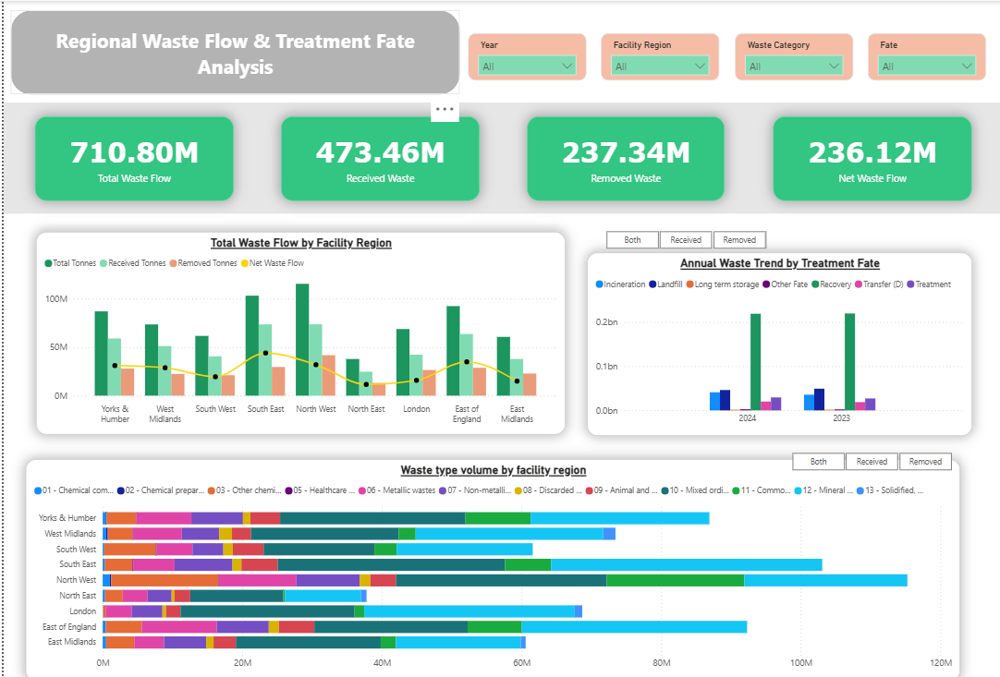
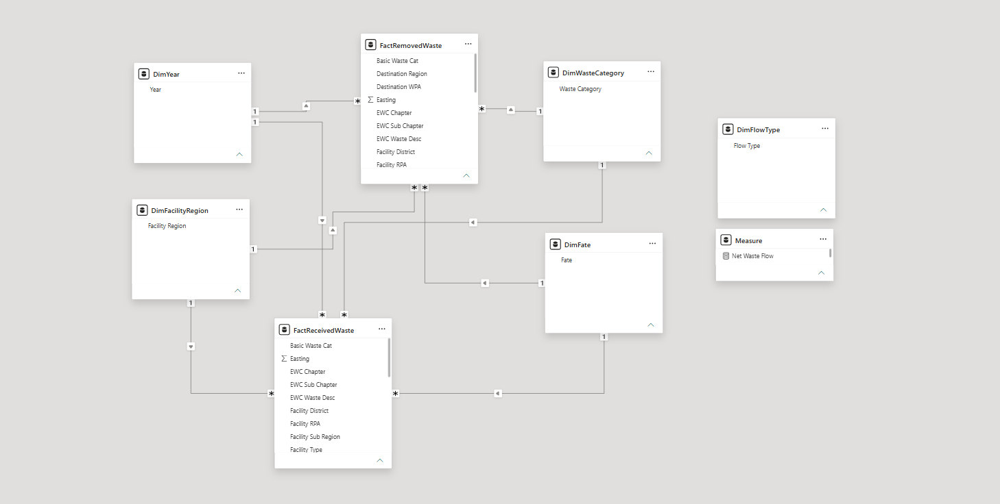
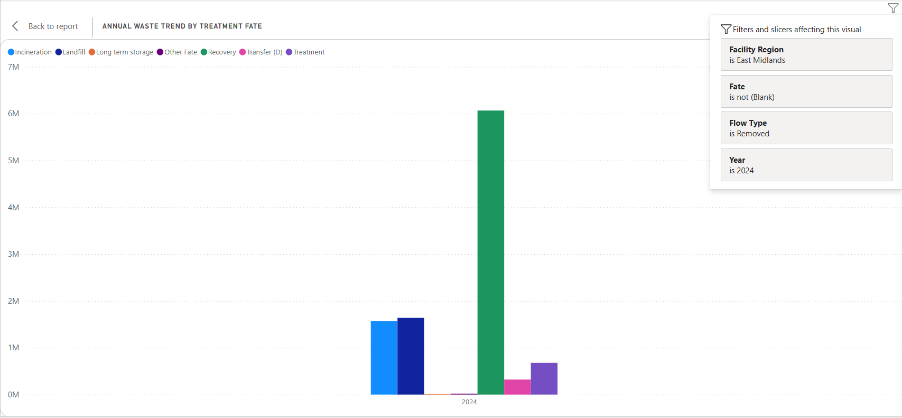
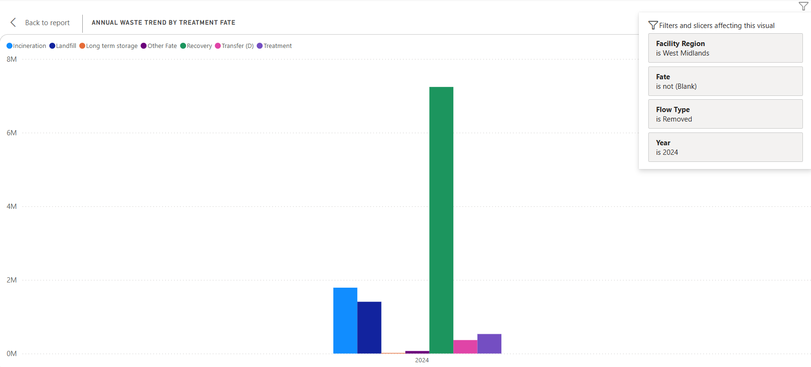
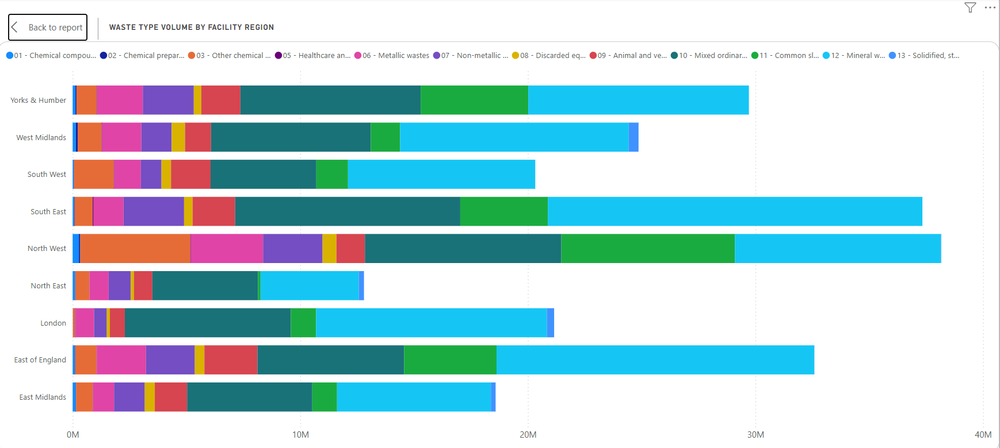
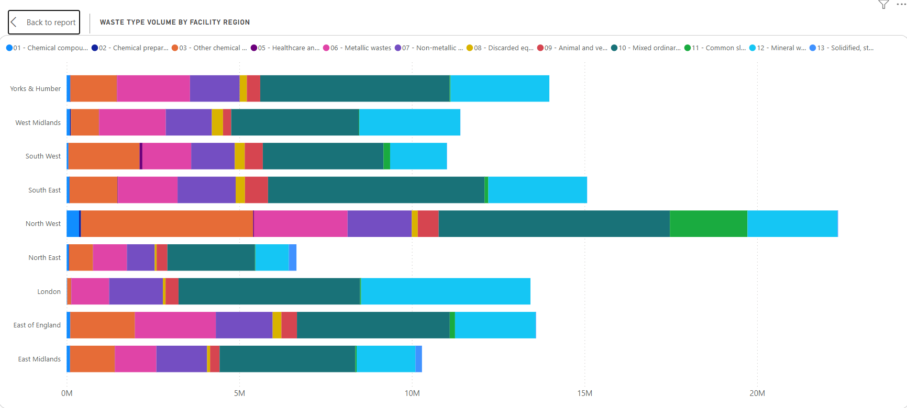
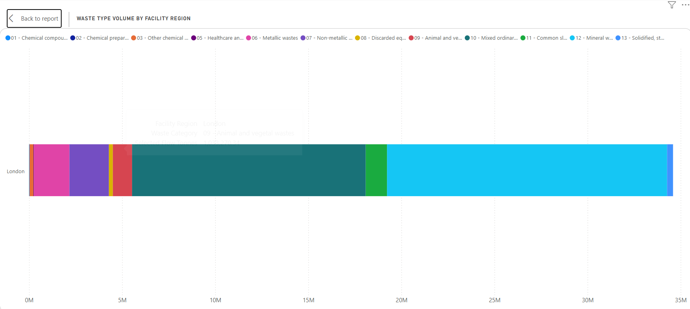
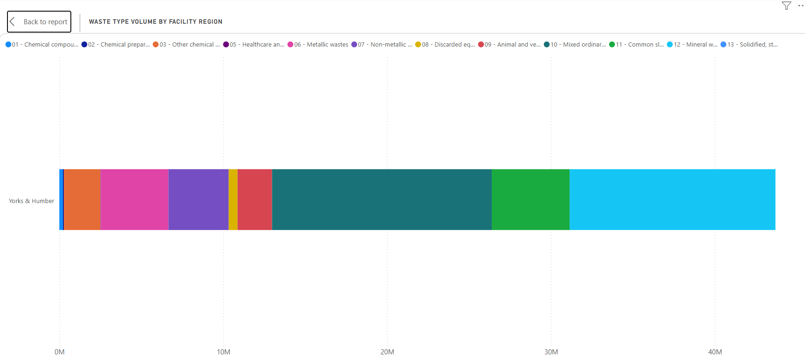

# EA Waste Data Interrogator (2023–2024): Regional Flow & Treatment Analysis

A Power BI analytics project built on the UK Environment Agency's national **Waste Data Interrogator** dataset, covering waste received and removed across ~6,000 regulated facilities in England for 2023 and 2024.

https://environment.data.gov.uk/dataset/a6dc56e6-fdbd-4f06-b8bc-f358cb1ec471
https://environment.data.gov.uk/dataset/134f7ce9-5123-4813-b4e5-c4fdf621200d
 

The goal: turn a notoriously large, messy, government dataset into a reliable, decision-ready view of how waste moves around the country, what happens to it, and where the regional pressure points are... without falling into the classic trap of double-counting tonnage.

---

## 1. Problem Statement

The Environment Agency publishes two separate views of the same national waste system every year:

- **Wastes Received** — what arrived at a permitted facility, where it came from, and how much
- **Wastes Removed** — what left a facility, where it went, and its final **fate** (landfill, recovery, incineration, treatment, transfer, etc.)

On their own, these files are huge (300,000+ rows combined), published in heavy `.xlsb` binary format, and inconsistent year-to-year in formatting and sheet naming.

**The core risk:** if "received" and "removed" tonnage are merged or summed together carelessly, the same physical waste gets counted twice — once on the way in, once on the way out — and every regional comparison becomes unreliable.

**The objective** was to answer three specific business questions:

1. What happens to waste once it's received or removed, by region? (**Fate**)
2. What types of waste are moving in and out, by region? (**Category**)
3. How are volumes, movements, and fates trending across 2023 → 2024? (**Trend**)

---

## 2. Data Source

- **Provider:** UK Environment Agency
- **Dataset:** [Waste Data Interrogator](https://environment.data.gov.uk/dataset/a6dc56e6-fdbd-4f06-b8bc-f358cb1ec471) (2023 & 2024 releases)
- **Format:** Excel binary (`.xlsb`), split into separate *Received* and *Removed* extracts per year
- **Scale:** Data from ~6,000 regulated waste sites across England
- **Known data quirk:** Operators who have successfully claimed *commercial confidentiality* have their site/operator details withheld — the tonnage is still reported, but the identifying fields are blank.

---

## 3. Methodology & Data Engineering

### 3.1 The Challenge
Loading multiple years of `.xlsb` files directly into Power Query is slow and prone to crashing given the file size and binary format.

### 3.2 The Solution — Python ETL
Rather than clean the data inside Power BI, the extraction and merging step was handled upstream in **Python**:

- Used **`pandas`** with the **`pyxlsb`** engine to read the binary files directly, bypassing Excel/Power Query limitations entirely
- Used **Regex** to automatically detect and extract the year (2023 / 2024) from each filename, then stamped it as a new `Year` column on every row — this also future-proofs the pipeline for new yearly drops without manual edits
- Built in a fallback sheet-matching step: if the exact expected tab name (e.g. *"2024 Waste Received"*) wasn't found, the script searches all sheet names for a partial match — protecting the pipeline against the Environment Agency renaming tabs between years
- Concatenated all years into two clean, lightweight master files:
  - `Merged_Waste_Data_Received_2023-2024.xlsx`
  - `Merged_Waste_Data_Removed_2023-2024.xlsx`

### 3.3 Data Cleaning Philosophy
A deliberate decision was made to **retain** missing and duplicate values rather than strip them out:

- **Missing region/operator values** are largely the result of commercial confidentiality redactions, not data errors. Deleting them would have artificially reduced the national tonnage totals.
- **Apparent duplicate rows** in this context typically represent genuinely separate, identical-weight transactions (e.g. two trucks delivering the same tonnage from the same site on the same day) rather than system errors.

This meant prioritising **absolute accuracy of the totals and KPIs** over a "cleaner-looking" but quietly biased dataset.

---

## 4. Dashboard Architecture (Power BI)



### 4.1 Data Model — Star Schema



To prevent double-counting, the model deliberately keeps inbound and outbound waste as **two independent fact tables**, joined through shared dimensions:

| Table | Type | Purpose |
|---|---|---|
| `FactReceivedWaste` | Fact | Inbound tonnage, origin, waste classification |
| `FactRemovedWaste` | Fact | Outbound tonnage, destination, waste classification, **Fate** |
| `DimYear` | Dimension | 2023 / 2024 |
| `DimFacilityRegion` | Dimension | English regions (London, West Midlands, Yorkshire & Humber, etc.) |
| `DimWasteCategory` | Dimension | High-level waste category (Mineral, Mixed Ordinary, Chemical, Metallic, etc.) |
| `DimFate` | Dimension | Final treatment outcome (Landfill, Recovery, Incineration, Treatment, Transfer) |
| `DimFlowType` | Disconnected helper table | Manually entered ("Both" / "Received" / "Removed") — drives the interactive toggle buttons |
| `Measure` | Calculation group | Houses core DAX measures, including **Net Waste Flow** |

**Why this works:** linking the dimension tables to *both* fact tables creates a shared filtering bridge — selecting "London" or "2024" filters inbound and outbound data simultaneously, without ever merging the two into one flat (and inflated) table.

The `DimFlowType` table has no relationship lines to anything else by design — it exists purely to feed a DAX `SWITCH()` measure that powers the **Both / Received / Removed** toggle buttons on the dashboard.

### 4.2 Why "Net Waste Flow" is the headline metric
- **Total Waste Flow** (Received + Removed) reflects total *operational handling effort* — useful for understanding facility workload, but not actual waste volume.
- **Net Waste Flow** (Received − Removed) reflects the **true physical accumulation or depletion** of waste in a region — the number that should actually inform infrastructure and capacity decisions.

### 4.3 Key Visuals
- **KPI cards** — Total Waste Flow, Received, Removed, Net Waste Flow (with Year / Region / Category / Fate slicers)
- **Total Waste Flow by Facility Region** — clustered column + line combo, comparing total/received/removed tonnage and net flow trend across all English regions
- **Annual Waste Trend by Treatment Fate** — clustered column chart, Year on the X-axis, broken down by Fate, with a *Both / Received / Removed* toggle
- **Waste Type Volume by Facility Region** — stacked bar chart showing the composition of waste categories per region, also togglable by flow direction

### 4.4 Data Integrity Note
The **"(Blank)"** options visible in the Region and Fate slicers are intentional — they represent EA commercial-confidentiality redactions. These were deliberately retained rather than filtered out, to avoid silently deflating the national totals and introducing survivorship bias into the analysis.

---

## 5. Key Findings

### 5.1 National Headline Numbers (2023–2024 combined)

| Metric | Value |
|---|---|
| Total Operational Handling | **710.80 MT** |
| Inbound (Received) | **473.46 MT** |
| Outbound (Removed) | **237.34 MT** |
| **Net Waste Flow** | **236.12 MT** |

| Year | Total Flow | Received | Removed | Net Flow |
|---|---|---|---|---|
| 2023 | 352.52M | 234.46M | 118.06M | 116.40M |
| 2024 | 358.27M | 238.99M | 119.28M | 119.72M |

### 5.2 Insight #1 — Regional Volumes of Waste Fate
- **London (2024)** strongly prioritises **Recovery** (7.6 MT), with negligible landfill usage — the most sustainability-forward profile of any region analysed.
- **West Midlands (2024):** Transfer = 366 KT, Treatment = 530 KT
- **East Midlands (2024):** Transfer = 320 KT, Treatment = 677 KT — the East Midlands processes notably more waste through direct treatment than its western neighbour.




### 5.3 Insight #2 — Regional Volumes by Waste Type
- **Nationally, inbound (Received) waste is dominated by Mineral Wastes** — the heaviest, bulkiest category, with direct implications for road/rail freight planning.

- **Nationally, outbound (Removed) waste is dominated by Mixed Ordinary Wastes.**

- **Regional contrast (2024):** London's profile is Minerals > Mixed Ordinary Wastes, while **Yorkshire & Humber inverts this entirely** — Mixed Ordinary Wastes > Minerals — pointing to fundamentally different regional waste economies (construction-heavy vs. general municipal/commercial waste).



### 5.4 Insight #3 — Trends in Volumes & Flow (2023 vs 2024)
- **Recovery (2023):** Yorkshire & Humber led the country at 32.6 MT total (11.7 MT net flow); the North East was lowest at 10.6 MT (2.8 MT net flow).

- **Incineration (2024):** The South East led at 6.1 MT total (1.7 MT net flow); the North East was again lowest, at 2.4 MT.

- **Notable anomaly:** The **North West** showed a **negative net flow** in parts of the analysis (Removed > Received) — indicating the region was clearing a historical backlog rather than processing fresh, like-for-like waste.
---

## 6. Recommendations

1. **Logistics Forecasting** — Regional waste-type dominance (e.g. London's Mineral-heavy inbound profile) can be used to forecast and optimise heavy freight and transport routing.
2. **Capacity Planning** — Anomalies such as the North West's negative net flow should be investigated further, as they may signal future facility capacity shortages or one-off backlog clearance.
3. **Commercial Data Governance** — Establish clear, documented rules for handling confidential/blank entries so that stakeholders make decisions based on absolute physical reality, not artificially filtered data.
4. **Automate Client Reporting** — This Python (ETL) → Power BI pipeline is fully reusable. It can directly replace manual Excel-based tracking for similar regional/operational reporting use cases.

---

## 7. Tech Stack

| Layer | Tools |
|---|---|
| Data Extraction & Cleaning | Python (`pandas`, `pyxlsb`, `re`) |
| Data Modelling | Power BI (Star Schema, DAX) |
| Visualisation | Power BI (clustered column, stacked bar, KPI cards, dynamic toggles) |
| Source Data | UK Environment Agency — Waste Data Interrogator (2023 & 2024) |

---

## 8. Repository Structure

```
.
├── data/
│   ├── raw/                 # Original EA .xlsb extracts (Received & Removed, by year)
│   └── clean/                # Python-merged master files (Received / Removed)
├── etl/
│   ├── clean_received.py     # Extracts, year-stamps, and merges "Wastes Received" files
│   └── clean_removed.py      # Extracts, year-stamps, and merges "Wastes Removed" files
├── dashboard/
│   └── Waste_Data_Interrogator.pbix
├── Waste_Data_Interrogator_2023-2024.pptx   # Presentation deck
└── README.md
```

---

## 9. Notes & Caveats

- This analysis covers **2023 and 2024 only**; longer-term multi-year trends would benefit from incorporating earlier EA releases.
- "Total Waste Flow" intentionally **double-counts** by design (Received + Removed) and should be read as an *operational handling* metric, not a measure of physical waste volume — **Net Waste Flow** is the correct metric for that.
- Confidentiality-driven blanks mean a small percentage of tonnage cannot be attributed to a specific region or operator, by EA design — this is a feature of the source data, not a gap in the analysis.

---

*Built by Yasir Savanur — [Portfolio](https://yasirsavanur.github.io/) · [GitHub](https://github.com/yasirsavanur)*
